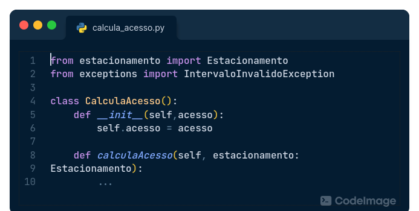

# Extensibilidade

## Descrição

Códigos bem projetados devem ser capazes de serem incrementados com novas funcionalidades 
facilmente quando necessário. Pensar muito na extensibilidade do código pode fazer com que
o software fique muito genérico e confuso para os desenvolvedores.

Dito isso, o maior desafio dos desenvolvedores para se alcançar a extensibilidade é 
encontrar o equilíbrio do que o software realmente precisa fazer e de quais possíveis
funcionalidade ele pode passar a receber no futuro.

## Relação com Maus Cheiros

- Método longo: Métodos longos costumam agrupar várias operações diferentes em um método só, isso dificulta o uso dessas operações por parte de novas funcionalidades;
- Longa lista de parâmetros: Longas listas de parâmetros tornam o método difícil de entende e difícil de usar;
- Cirurgia com Rifle: Quando várias classes precisam sofrer modificações para realizar apenas uma mudança, dificultando a adição de novas regras e funcionalidades no projeto;
- Instruções switch: Várias instruções switch com os mesmos cases espalhadas no código dificultam a adição de novos casos pois torna necessária a alteração em várias partes do código.

## Operações de refatoração relacionadas

- Extrair Método: Tranformar em um método separado pode auxiliar com métodos longos, diminuindo assim seu tamanho. Maus cheiros relacionados: Método longo, Instruções switch;
- Substituir Método por método-objeto: Transformar o método em uma classe que tem como objetivo apenas executar esse método, tirando a responsabilidade das operações desse método de dentro da classe anterior. Maus cheiros relacionados: Método longo;
- Introduzir objeto-parâmetro: Transformar os vários parâmetros do método em um objeto, facilitando o uso desse método por outras classes. Maus cheiros relacionados: Longa lista de parâmetros;
- Mover método/mover campo: Mover métodos e campos pras classes que mais o utilizam, evitando ter que fazer alterações em várias classes. Maus cheiros relacionados: Cirurgia com Rifle, Instruções switch;
- Trocar Tipo por Subclasse ou Strategy/State: É recomendado utilizar polimorfismo em casos que o comportamento de uma operação muda de acordo com o tipo do objeto. Maus cheiros relacionados: Instruções switch.

Exemplo de refatoração no código de levou a ter a característica em análise:

Podemos ver na imagem acima a técnica de substituir método por método-objeto em que a classe CalculaAcesso tem como objetivo calcular o acesso nos estacionamentos, isso permite que novas formas de calcular diferentes acessos sejam adicionadas nessa classe, permitindo a extensibilidade do código.

## Bibliografia

* https://refactoring.guru/
* Code Craft : The Practice of Writing Excellent Code, No Starch Press, Incorporated, 2006. ProQuest Ebook Central, https://ebookcentral.proquest.com/lib/univbrasilia-ebooks/detail.action?docID=273481.