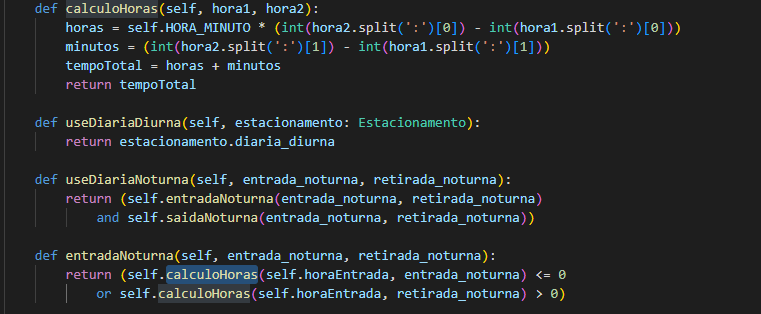

# Modularidade

## Descrição

Para se desenvolver o design de um problema, é natural dividí-lo em parte, chamadas de módulos ou componentes. Podemos chamá-los de subsistemas, bibliotecas, pacotes, classes, etc, cada parte menos complexa que o problema original, mas quando juntas formam uma solução completa. As qualidades principais da modularidade são: 
- **Coesão:** É uma medida de como funcionalidades relacionadas são reunidas e quão bem as partes dentro de um módulo funcionam como um todo. A coesão é a cola que mantém um módulo unido. Sem ela existem apenas partes soltas e para isso acontecer, cada módulo deve ter um papel bem definido.
- **Baixo Acoplamento:** Primeiramente, acoplamento é uma medida da interdependência entre os módulos. Em projetos mais simples, os módulos têm pouco acoplamento e, portanto, são menos dependentes uns dos outros. É claro que módulos não podem ser totalmente desacoplados, ou eles não estariam trabalhando em conjunto em um mesmo sistema. Os módulos se interconectam de diversas maneiras: diretas, indiretas, por chamadas de funções em outros módulos ou ser chamado por outros módulos. Ele pode usar os tipos de dados de outro módulo ou compartilhar alguns dados (talvez variáveis ou arquivos). 

Um bom design de software limita as linhas de comunicação apenas àquelas absolutamente necessárias. Essas linhas de comunicação fazem parte do que determina a arquitetura do código. Uma vez identificado, cada módulo pode ser trabalhado isoladamente e testado separadamente. Esta é a vantagem da modularidade, poder dividir tarefas entre programadores (mas cuidado, certifique-se de que a decomposição seja sensata e baseada no problema, não na organização da equipe). 

## Relação com maus cheiros

Os seguintes maus cheiros podem estar relacionados com essa característica:

- **Cirurgia com rifle:** Ao realizar uma mudança várias classes devem sofrer modificações. É difícil de encontrar todos os lugares afetados, e fácil de esquecer alguma modificação.
- **Hierarquias de herança paralelas:** Caso especial de cirurgia com rifle: Sempre que adicionar uma subclasse em um ramo, terá que adicionar a mesma subclasse no outro ramo.
- **Inveja de recursos:** Quando métodos de uma classe estão mais interessados nos recursos de outras classes (geralmente atributos). Utilização excessiva de métodos get de uma classe é indício de inveja de recursos.
- **Classe preguiçosa:** O excesso do uso da modularização pode gerar classes que não possuem comportamento suficiente para serem mantidas no projeto.
- **Cadeias de mensagens:** Ocorre quando um objeto chama outro, que chama outro, que chama outro e assim sucessivamente. Geralmente ocorre por meio de métodos Get. É também um indício de alto acoplamento: o projeto está ligado à navegação dos métodos.

## Operações de refatoração relacionadas

As seguintes refatorações podem ser aplicadas:

- Mover método ou mover campo: para colocar todas as variações em uma única classe. 
- Incorporar classe: para agrupar um conjunto de comportamentos em uma única estrutura (aumentar a coesão, caso ela tenha sido afetada com a movimentação de métodos e campos).
- Extrair método / mover método: para casos de Inveja de recursos que ocorre apenas em um trecho do código da outra classe. Já nos casos de Cadeias de mensagens, extrair o trecho de código que é utilizado pelo cliente e movê-lo para pontos iniciais da cadeia. 

Exemplo de refatoração no código de levou a ter a característica em análise:

A imagem acima demonstra um exemplo de método extraído, separando funções para que cada uma realize uma solução específica, trazendo mais coesão para a classe.

## Bibliografia

Livro: [Code Craft : The Practice of Writing Excellent Code, No Starch Press, Incorporated, 2006. ProQuest Ebook Central](https://ebookcentral.proquest.com/lib/univbrasilia-ebooks/detail.action?docID=273481)